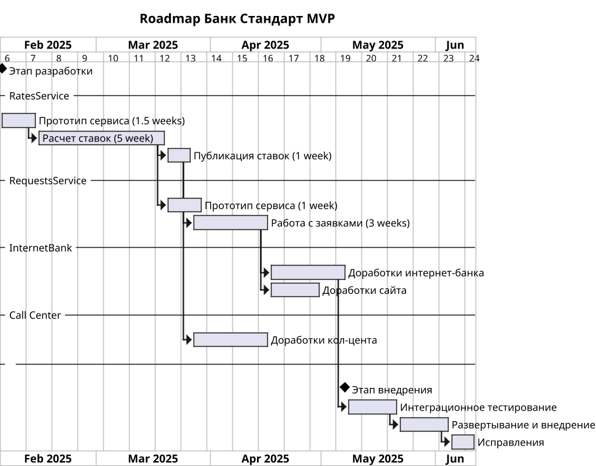

# MVP Roadmap

Исходя из целей банка, в рамках MVP реализуется функциональность онлайн открытия накопительного счет или депозита с
использованием интернет-банка. 

Срок MVP ограничен 6 месяцами.

```puml
@startgantt
title Roadmap Банк Стандарт MVP

scale 1.5
projectscale weekly

'saturday are closed
'sunday are closed

Project starts the 03 of February 2025
[Этап разработки] happens at 03 of February 2025

-- RatesService --
[Прототип сервиса (1.5 weeks)] as [RatePrototypeTask] requires 10 days
[Расчет ставок (5 week)] as [RatesFetchTask] requires 5 week
[Публикация ставок (1 week)] as [RatesPubTask] requires 1 week
[RatePrototypeTask]->[RatesFetchTask]
[RatesFetchTask]->[RatesPubTask]

-- RequestsService --
[Прототип сервиса (1 week)] as [ReqProtoTask] starts at [RatesFetchTask]'s end and requires 10 days
[Работа с заявками (3 weeks)] as [ReqServiceTask] requires 3 week
[ReqServiceTask] starts at [RatesPubTask]'s end

-- InternetBank --
[Доработки интернет-банка] starts at [ReqServiceTask]'s end and requires 3 weeks 
[Доработки сайта] starts at [ReqServiceTask]'s end and requires 2 weeks 

-- Call Center --
[Доработки кол-цента] starts at [RatesPubTask]'s end and requires 3 weeks

-- --
[Этап внедрения] happens at [Доработки интернет-банка]'s end
[Интеграционное тестирование] starts at [Доработки интернет-банка]'s end and requires 2 week
[Развертывание и внедрение] starts at [Интеграционное тестирование]'s end and requires 2 week
[Исправления] starts at [Развертывание и внедрение]'s end and requires 1 week

@endgantt

```
