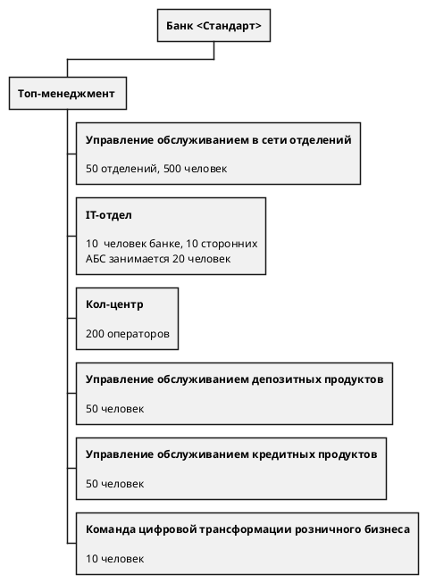

# Организационная структура

# IT-ландшафт компании

- **Интернет-банк**. Клиент-серверная система на веб-фреймворке ASP.NET MVC 4.5 на основе .NET Framework 4.5 и СУБД MS
  SQL.
  Монолит реализован на платформе подрядчика. Команда банка может самостоятельно вносить изменения,
  но обновление ядра системы привязано к подрядчику. Интернет-банк работает на одной группе серверов в ЦОД.
  Также есть резервный ЦОД, на который можно переключиться в случае сбоя.\
- **Автоматизированная банковская система (АБС)**. Интерфейс пользователей — это десктопный клиент на Delphi и СУБД на
  Oracle.
  Основная логика работы системы реализована процедурами на PL-SQL в СУБД. Система полностью разрабатывается внутри
  банка.
- **Система кол-центра**. Это клиент-серверная система на платформе подрядчика, работает на технологиях подрядчика.
  Сама платформа предназначена для автоматизации CRM-решений, но банк использует только функционал кол-центра.
  У системы веб-интерфейс на React.js, бэкенд на Java Spring Boot и базы PostgreSQL. Архитектура микросервисная.
  Система развёрнута в инфраструктуре банка и полностью поддерживается подрядчиком.
  В команде АБС есть несколько специалистов с опытом в Java-стеке.
  Они могут периодически вносить изменения в систему самостоятельно по просьбе бизнеса, поскольку она имеет возможности
  для расширения.
- **Система партнёрского кол-центра**. Это внешняя система.
  Партнёрский кол-центр и подрядчик, чью систему использует кол-центра банка, — разные компании.
- **СМС-шлюз телеком-оператора**. Его поддерживает IT-отдел банка, взаимодействуя с телеком-оператором.
- **Телеком-оператор** — внешний оператор по отправке СМС.
- **Сайт** — собственная разработка банка на PHP и React.js.

# Бизнес-возможности

| Продажи и маркетинг         | Поддержка операционнных процессов |
|-----------------------------|:----------------------------------|
| Продажи в сети отделений    | Обслуживание депозитных процессов |
| Продажи через кол-центр     | Обслуживание кредитных процессов  |
| Digital-оповещения клиентов | Управление договорами             |

# MVP (6 месяцев)
- Клиент может полностью автоматически открыть депозит или накопительный счёт в интернет-банке
- При обращении в отделение депозит открывается без участия сотрудников бэк-офиса
- Можно оформить заявку на депозит онлайн. Обрабатывать заявки продолжат сотрудники бэк-офиса